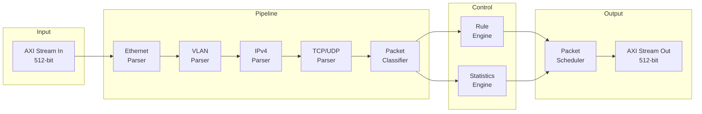
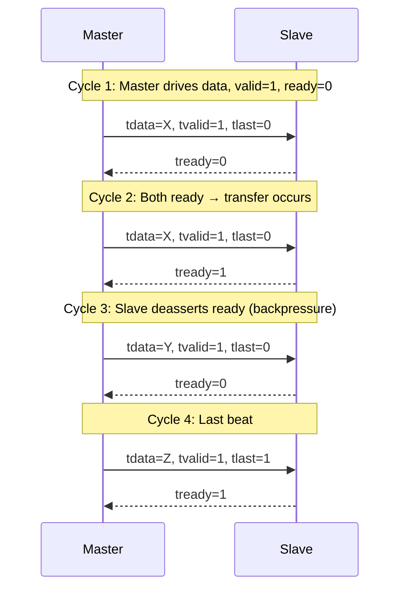
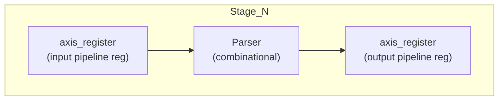
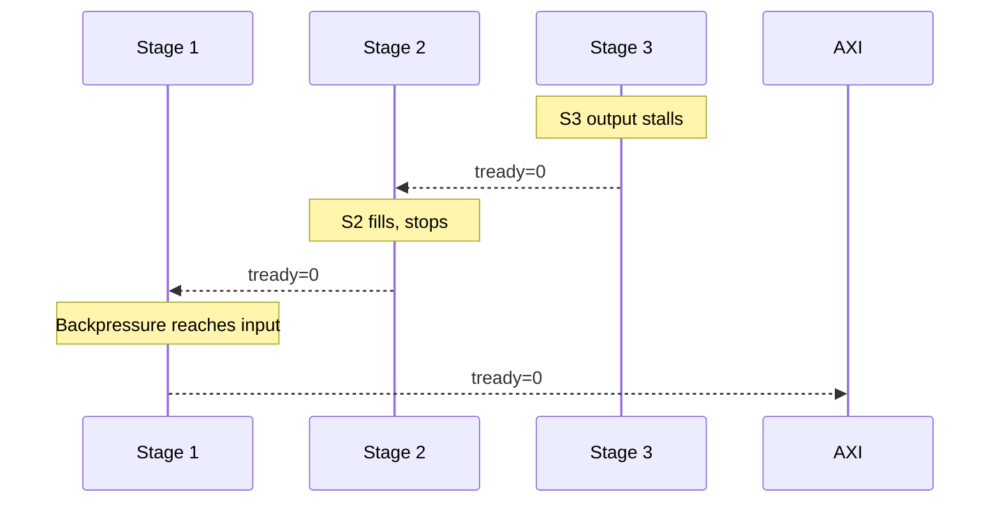
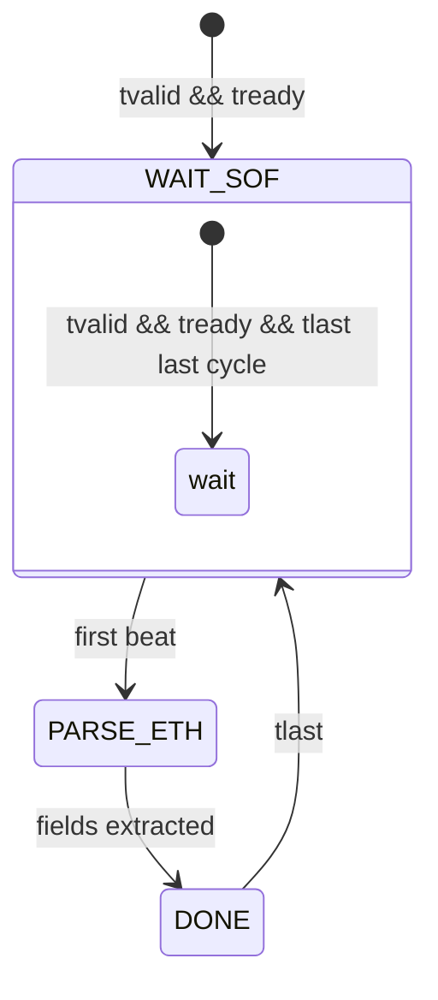
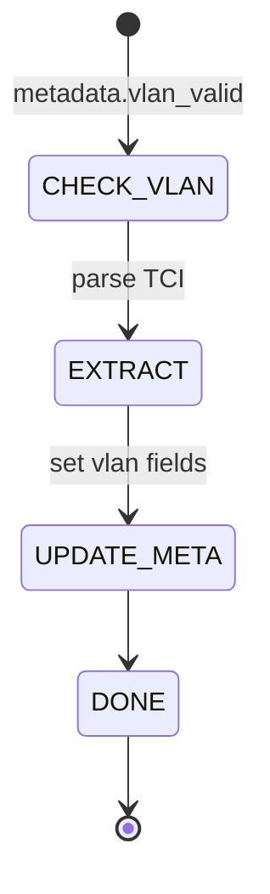
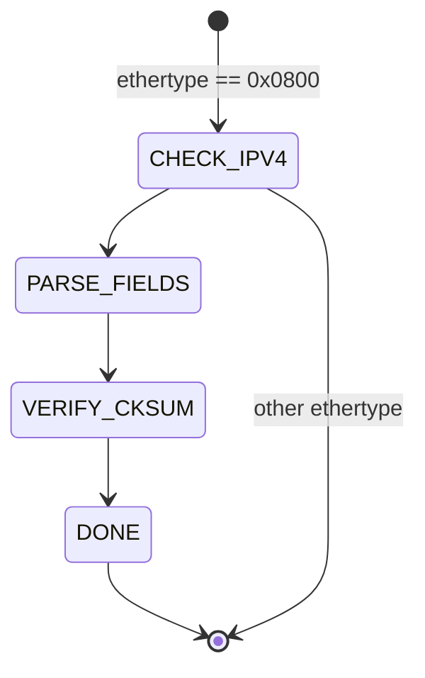
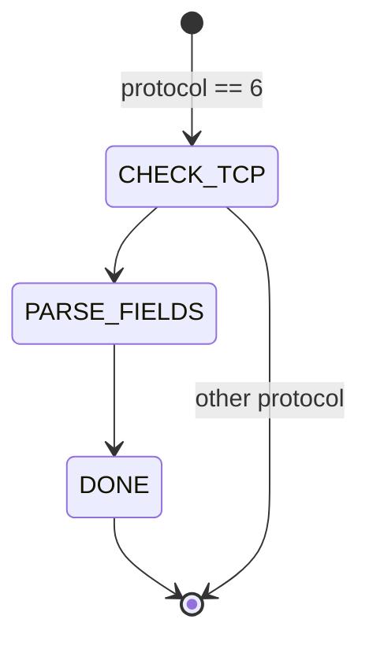

# FPGA Network Processing Engine — Architecture Document

**Version:** 0.1 — Phase 0
**Last updated:** 2026-07-18

---

## 1. System Overview

The NPE is a fully pipelined, configurable Layer 2–Layer 4 packet processing engine. It receives packets over a 512-bit AXI-Stream interface, parses Ethernet/IP/transport headers in a six-stage pipeline, classifies packets against a rule set, collects per-protocol statistics, and schedules packets for output.



### 1.1 Design Goals

| Goal | Approach |
|---|---|
| Fully pipelined | One stage per protocol parser, pipeline register at every boundary |
| Configurable | Parameters for bus widths, FIFO depths, max packet size, rule count |
| Synthesizable | Verilator-compatible SystemVerilog subset (no `interface`, `class`, `mailbox`) |
| Single-clock domain | All logic on rising edge of `clk`, synchronous active-low `rst_n` |
| Self-verifying | C++ testbenches with scoreboard, constrained-random packets, cycle-accurate checking |

### 1.2 Key Design Decisions

| Decision | Rationale |
|---|---|
| No `interface` keyword | Verilator does not support SV interfaces. We use `typedef struct packed` for bus bundling with split `tready`. |
| Single clock domain | Dramatically simplifies verification, timing closure, and FIFO design. |
| 512-bit datapath | 64 bytes/cycle = ~40 Gbps at 156.25 MHz, 100 Gbps at 390 MHz. Future-proof without excessive width. |
| Synchronous FIFOs | Single-clock BRAM FIFOs are simpler, smaller, and faster than dual-clock. No clock crossing needed. |
| Metadata bus alongside packet data | Every pipeline stage outputs a metadata struct. No re-parsing. Exactly like real networking ASICs. |
| C++ testbenches | Verilator's native model. Gives us OOP for scoreboards, constrained-random (via std::mt19937), and fast simulation. |

---

## 2. AXI-Stream Bus Specification

### 2.1 Signal Definitions

| Signal | Width | Direction | Description |
|---|---|---|---|
| `tdata` | 512 | Forward | Packet data, MSB-first byte ordering |
| `tkeep` | 64 | Forward | One-hot valid byte lanes: bit `n` = byte `n` of `tdata` is valid |
| `tvalid` | 1 | Forward | Master asserts when `tdata`/`tkeep`/`tlast` are stable |
| `tlast` | 1 | Forward | Asserted on the last beat of a packet |
| `tuser` | TBD | Forward | Sideband metadata (error flags, parser status) |
| `tready` | 1 | Reverse | Slave asserts when it can accept a transfer |

### 2.2 Verilator-Compatible Struct Convention

```systemverilog
typedef struct packed {
  logic [511:0] tdata;
  logic [63:0]  tkeep;
  logic         tlast;
  logic         tvalid;
} axis_fwd_t;
```

Modules expose:

- `input  axis_fwd_t s_axis` — downstream-facing forward path
- `input  logic      s_axis_tready` — tied to upstream's ready output
- `output axis_fwd_t m_axis` — upstream-facing forward path
- `output logic      m_axis_tready` — backpressure signal

This keeps the forward bus bundled (cleaner code, easier to pipeline-register as a single struct) while splitting the reverse-direction `tready` as a scalar.

### 2.3 Ready/Valid Handshake



Rules:

- A transfer occurs on any cycle where `tvalid` and `tready` are both asserted.
- `tdata`, `tkeep`, `tlast` must be stable while `tvalid` is asserted and `tready` is low.
- `tvalid` must not depend on `tready` (no combinational loop; register `tvalid` before combining with `tready`).
- The master may assert `tvalid` without waiting for `tready`.

### 2.4 Start/End of Frame

- **SOF**: implied by `tvalid` asserted after a cycle where `tlast` was asserted (or at reset). No explicit SOF signal — `tuser` can carry a `sof` bit if needed.
- **EOF**: `tlast` asserted on the final beat. A single-beat packet has `tvalid` + `tlast` simultaneously.

### 2.5 Bus Width Analysis

| Line Rate | Clock Freq | Bus Width | Utilization |
|---|---|---|---|
| 1 Gbps | 156.25 MHz | 64-bit (8 B) | 12.8% |
| 10 Gbps | 156.25 MHz | 64-bit (8 B) | Full |
| 25 Gbps | 156.25 MHz | 512-bit (64 B) | ~50% |
| 40 Gbps | 156.25 MHz | 512-bit (64 B) | ~80% |
| 100 Gbps | 390.625 MHz | 512-bit (64 B) | Full |

At 156.25 MHz (common FPGA ethernet reference clock ÷ 4), 512 bits per cycle delivers ~80% of 40 Gbps line rate — sufficient for most use cases without needing a faster clock.

---

## 3. Pipeline Architecture

### 3.1 Stage Overview

```
 Stage        Module              Latency    Key Outputs
 ─────────────────────────────────────────────────────────
 Input        axis_register         1        Raw 512-bit beat
 Stage 1      ethernet_parser       1        dst_mac, src_mac, ethertype
 Stage 2      vlan_parser           1        vlan_id, vlan_prio, vlan_cfi
 Stage 3      ipv4_parser           1        src_ip, dst_ip, protocol, ttl, hdr_len, checksum_ok
 Stage 4      tcp_parser /          1        src_port, dst_port, flags, seq, ack, window
              udp_parser
 Stage 5      packet_classifier      1       class_id
 Stage 6      top_align             1        Pipeline alignment
```

Total minimum latency: **6 cycles** (plus 1 input reg = 7 cycles) for a packet with no backpressure.

### 3.2 Generic Pipeline Stage Template



Every stage follows this pattern:

```systemverilog
always_ff @(posedge clk) begin
    if (!rst_n) begin
        pipe_valid <= '0;
    end else if (m_axis_tready || !pipe_valid) begin
        pipe_valid <= s_axis.tvalid && s_axis_tready;
        pipe_data  <= parsed_data;
        pipe_meta  <= parsed_meta;
    end
end
```

This is a **skid-protected** register: if the next stage stalls (`m_axis_tready` deasserted) while `pipe_valid` is high, the current stage **stops loading** and propagates backpressure. This is the skid-free variant — we handle one outstanding beat. For full skid protection, add a second register (see `axis_register` implementation).

Actually, we use a simpler approach: each stage's output register IS the pipeline register, and we rely on the upstream ready/valid handshake for backpressure. No extra skid buffer needed for the initial implementation.

### 3.3 Stall Propagation



Backpressure propagates one stage per cycle. The head-of-line packet is held in the stage closest to the output. All upstream stages fill until the entire pipeline is stalled. This is simple and correct.

### 3.4 Metadata Bus

The metadata bus is the spine of the design. Every stage reads, modifies, and forwards it.

```systemverilog
typedef struct packed {
  // L2 Fields
  logic [47:0]  dst_mac;
  logic [47:0]  src_mac;
  logic [15:0]  ethertype;

  // VLAN
  logic         vlan_valid;
  logic [11:0]  vlan_id;
  logic [2:0]   vlan_prio;
  logic         vlan_cfi;

  // L3 Fields
  logic         ipv4_valid;
  logic [31:0]  src_ip;
  logic [31:0]  dst_ip;
  logic [7:0]   protocol;
  logic [7:0]   ttl;
  logic [3:0]   ip_hdr_len;    // in 32-bit words
  logic         ip_checksum_ok;

  // L4 Fields
  logic         tcp_valid;
  logic         udp_valid;
  logic [15:0]  src_port;
  logic [15:0]  dst_port;
  logic [3:0]   tcp_flags;     // SYN, ACK, FIN, RST
  logic [31:0]  tcp_seq;
  logic [31:0]  tcp_ack;
  logic [15:0]  tcp_window;

  // Classification
  logic [7:0]   class_id;
  logic         drop;

  // Error
  logic         crc_error;
  logic         parse_error;

  // Length
  logic [15:0]  pkt_length;    // total packet bytes
} packet_metadata_t;
```

**Total width:** ~272 bits (fits comfortably in a 512-bit bus alongside packet data if needed, but we keep it separate).

#### Validity Matrix

| Field | Stage 1 | Stage 2 | Stage 3 | Stage 4 | Stage 5 |
|---|---|---|---|---|---|
| dst_mac, src_mac, ethertype | ✓ | ✓ | ✓ | ✓ | ✓ |
| vlan_valid, vlan_id, ... | - | ✓ | ✓ | ✓ | ✓ |
| src_ip, dst_ip, protocol, ... | - | - | ✓ | ✓ | ✓ |
| src_port, dst_port, flags, ... | - | - | - | ✓ | ✓ |
| class_id, drop | - | - | - | - | ✓ |

All fields set to 0 / invalid before their defining stage. The metadata struct is initialized to all-zeroes at pipeline entry, and each stage fills in its fields.

---

## 4. Protocol Parser Specifications

### 4.1 Ethernet Parser

**Input:** Raw AXI-Stream beat(s)

**Parsing logic (combinational):**

- Bytes 0–5: Destination MAC
- Bytes 6–11: Source MAC
- Bytes 12–13: EtherType
- If EtherType == 0x8100 → VLAN present (set `vlan_valid`, pass to VLAN parser)
- If EtherType < 0x0600 → 802.3 length field (legacy — log, treat as valid)
- Minimum frame size: 64 bytes (padding assumed)
- CRC (FCS) is the last 4 bytes; stripped before parsing or checked by monitor



**Error conditions:**

- Frame too short (< 64 bytes after stripping FCS)
- Unknown EtherType (not IPv4=0x0800, ARP=0x0806, VLAN=0x8100)

**Latency:** 1 cycle (combinational decode + output register)

### 4.2 VLAN Parser

**Input:** Ethernet parser metadata + raw data beat

**Parsing logic:**

- Bytes 14–15: Tag Protocol Identifier (must be 0x8100 to reach this stage)
- Bytes 16–17: Tag Control Information
  - Bits 15–13: Priority (PCP)
  - Bit 12: Drop Eligible Indicator (DEI, formerly CFI)
  - Bits 11–0: VLAN ID (VID)
- Next 2 bytes: actual EtherType (inner type, e.g., 0x0800 for IPv4)

Overwrites `ethertype` with the inner EtherType for downstream stages.



**Latency:** 1 cycle

### 4.3 IPv4 Parser

**Input:** Raw data beat (byte offset depends on VLAN presence)

**Parsing logic (byte offsets assuming no VLAN header):**

- Byte 14: Version / IHL (Version = 4 for IPv4, IHL = header length in 32-bit words, minimum 5)
- Byte 15: DSCP / ECN
- Bytes 16–17: Total Length
- Bytes 18–19: Identification
- Bytes 20–21: Flags / Fragment Offset
- Byte 22: TTL
- Byte 23: Protocol (next header: 6=TCP, 17=UDP, 1=ICMP)
- Bytes 24–25: Header Checksum
- Bytes 26–29: Source IP
- Bytes 30–33: Destination IP
- Bytes 34–37+: Options (if IHL > 5, variable length)

**Checksum verification:**

```systemverilog
// Recompute checksum over the header (IHL * 4 bytes)
// Compare with stored checksum field
logic [15:0] calc_cksum;
assign calc_cksum = ~ip_header_checksum(ip_header);
assign ip_checksum_ok = (calc_cksum == '0);
```

Checksum is verified in parallel with field extraction; `ip_checksum_ok` is set on the same cycle.



**Error conditions:**

- Version != 4
- IHL < 5
- Total Length < 20
- Checksum mismatch
- TTL == 0

**Latency:** 1 cycle (combinational)

### 4.4 UDP Parser

**Input:** Raw data beat at L4 offset (IP header length dependent)

**Parsing logic (offset = L2 header + VLAN + IP header):**

- Bytes 0–1: Source Port
- Bytes 2–3: Destination Port
- Bytes 4–5: Length (UDP header + payload)
- Bytes 6–7: Checksum (optional in IPv4)

**Latency:** 1 cycle (combinational decode, no FSM needed)

### 4.5 TCP Parser

**Parsing logic (same offset as UDP):**

- Bytes 0–1: Source Port
- Bytes 2–3: Destination Port
- Bytes 4–7: Sequence Number
- Bytes 8–11: Acknowledgment Number
- Byte 12: Data Offset (upper 4 bits, in 32-bit words)
- Byte 13: Flags (lower 6 bits: URG, ACK, PSH, RST, SYN, FIN)
- Bytes 14–15: Window Size
- Bytes 16–17: Checksum
- Bytes 18–19: Urgent Pointer
- Bytes 20+: Options (Data Offset − 5) * 4 bytes



**Latency:** 1 cycle

**Notes:**

- TCP header minimum is 20 bytes; connections to `tcp_valid` only if data offset >= 5 and no fragment offset
- Fragmented IP packets: skip L4 parsing (fragment offset != 0 or MF flag set)

---

## 5. Packet Classifier (Preview)

**Purpose:** Map parsed 5-tuple to a class ID:

```
(src_ip, dst_ip, protocol, src_port, dst_port) → class_id
```

**Implementation:** TCAM-like ternary match on a small rule table (up to 64 entries initially). Each rule has:

- Match fields (with don't-care masks)
- Priority
- Action: ALLOW / DROP / REDIRECT / MIRROR
- Class ID

**Latency:** 1–2 cycles (combinational priority encoder + decision)

Detailed specification will be produced in Phase 4.

---

## 6. Rule Engine & Statistics Engine (Preview)

### 6.1 Rule Engine

Separate from the classifier. The classifier determines the packet's class; the rule engine determines what to **do** with it.

- ALLOW: forward to output scheduler
- DROP: set `drop` flag in metadata, count drop
- REDIRECT: enqueue to specific output queue (future)
- MIRROR: copy packet to monitor port (future)

### 6.2 Statistics Engine

Per-protocol counters incremented when packets complete the pipeline:

| Counter | Width | Incremented When |
|---|---|---|
| `rx_packets` | 48 | Any valid packet |
| `rx_bytes` | 64 | Sum of `pkt_length` |
| `rx_ipv4` | 48 | `ipv4_valid` |
| `rx_tcp` | 48 | `tcp_valid` |
| `rx_udp` | 48 | `udp_valid` |
| `rx_arp` | 48 | `ethertype == 0x0806` |
| `rx_drops` | 48 | `drop` flag set |
| `rx_crc_errors` | 48 | `crc_error` |
| `rx_parse_errors` | 48 | `parse_error` |

---

## 7. Clocking & Reset

### 7.1 Clock

- **Single clock domain:** `clk`, rising-edge active
- All sequential elements (`always_ff @(posedge clk)`) use this clock
- No generated clocks, no clock gating in initial implementation

### 7.2 Reset

- **Synchronous active-low reset:** `rst_n`
- All pipeline registers, FIFO pointers, and state machines reset to their idle/empty state
- Reset is **not** used for BRAM contents (BRAM initializes to X in simulation, don't-care in hardware)
- Minimum reset assertion: 4 clock cycles
- Deassertion: synchronous, no meta-stability concerns (single clock domain)

---

## 8. Parameterization Strategy

### 8.1 Module Parameters

| Module | Parameter | Default | Range |
|---|---|---|---|
| `axis_fifo` | `DATA_WIDTH` | 512 | 8, 16, 32, 64, 128, 256, 512 |
| | `DEPTH` | 16 | 2–65536 |
| | `ALMOST_FULL_TH` | DEPTH-2 | 0–DEPTH |
| | `ALMOST_EMPTY_TH` | 2 | 0–DEPTH |
| `ethernet_parser` | `DATA_WIDTH` | 512 | 64+ |
| `ipv4_parser` | `DATA_WIDTH` | 512 | 64+ |
| `packet_classifier` | `NUM_RULES` | 32 | 1–256 |
| `stats_engine` | `NUM_PROTOCOLS` | 16 | — |

### 8.2 Top-Level Parameters

```systemverilog
module npe_top #(
    parameter int AXIS_DATA_WIDTH = 512,
    parameter int FIFO_DEPTH      = 16,
    parameter int NUM_RULES       = 32,
    parameter int NUM_QUEUES      = 3
) (
    input  logic        clk,
    input  logic        rst_n,
    // Input AXI-Stream
    input  axis_fwd_t   s_axis,
    input  logic        s_axis_tready,
    // Output AXI-Stream
    output axis_fwd_t   m_axis,
    output logic        m_axis_tready,
    // Control / Status (register interface)
    // ...
);
```

---

## 9. Verification Strategy

### 9.1 Approach

- **C++ testbenches** with Verilator's `V{module}.h` interface
- **Self-checking** — every test compares DUT output against a reference model
- **Scoreboard pattern** — expected packets are logged in a `std::deque`, matched against DUT output
- **Constrained-random** — `std::mt19937` generates packet sizes, header fields, inter-packet gaps
- **Waveform dumps** — VCD for debug, GTKWave for viewing

### 9.2 Testbench Structure

```
sim/
├── packet_generators/
│   └── packet_gen.h       // C++ class: builds raw Ethernet/IP/UDP/TCP packets
├── packet_monitors/
│   └── packet_mon.h       // C++ class: checks CRC, fields, timing
├── scoreboards/
│   └── scoreboard.h       // C++ class: reference model, match DUT output
├── testbenches/
│   ├── tb_axis_fifo.cpp   // FIFO standalone test
│   ├── tb_ethernet.cpp    // Ethernet parser test
│   ├── tb_ipv4.cpp        // IPv4 parser test
│   ├── tb_pipeline.cpp    // Full pipeline test
│   └── tb_rand_packets.cpp // Random regression
├── assertions/
│   └── (SV immediate assertions in RTL)
└── regression/
    └── run_regression.py
```

### 9.3 Test Types

| Test | Scope | Method |
|---|---|---|
| Smoke | Single module | Fixed packets, check outputs |
| Directed | Single module | Edge cases: min/max size, specific fields |
| Random | Pipeline | 1000+ random valid packets, check all fields |
| Malformed | Pipeline | Bad CRC, truncated, bad checksums, bad EtherType |
| Backpressure | FIFO | Full/empty transitions, almost full/empty thresholds |
| Performance | Pipeline | Measure throughput, latency, stalls |

### 9.4 Coverage Metrics

- Line coverage (Verilator `--coverage`)
- Toggle coverage (Verilator `--coverage-toggle`)
- Custom coverage: protocol mix, packet sizes, valid/invalid ratios

---

## 10. Appendix: Design Rationale

### Why Verilator and not Icarus / Vivado Sim?

- Verilator compiles SV to C++, yielding 10–100× faster simulation than interpreted simulators
- Command-line CI integration is trivial
- Coverage collection is built-in
- Trade-off: no SV `interface`, `class`, `program` — but these aren't needed for synthesizable RTL

### Why no dual-clock FIFOs?

- Single-clock FIFOs use fewer BRAM resources (no read/write pointer synchronization)
- Clock crossing adds verification complexity with no benefit until the project targets an actual SoC integration

### Why 512-bit datapath and not 64-bit?

- 64-bit at 156.25 MHz can barely saturate 10 Gbps
- 512-bit at 156.25 MHz gives headroom for 40 Gbps
- Wider buses reduce per-packet overhead (fewer beats per packet → fewer pipeline stalls)
- FPGA LUT/FF costs scale roughly linearly with width; BRAM costs don't increase for wider FIFOs

### Why struct-packed metadata and not AXI-Stream tuser?

- `tuser` width would need to be 272 bits and change as we add features
- A separate metadata bus (implicitly carried via pipeline registers) keeps the parser modules simple
- The metadata struct is versioned in `npe_pkg.sv`; adding a field doesn't change any port list
- Verilator handles `typedef struct packed` efficiently (flat bit vector under the hood)
